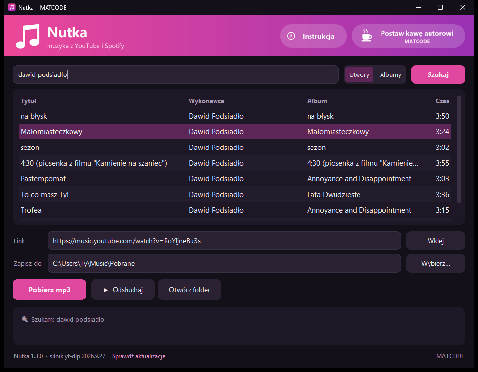
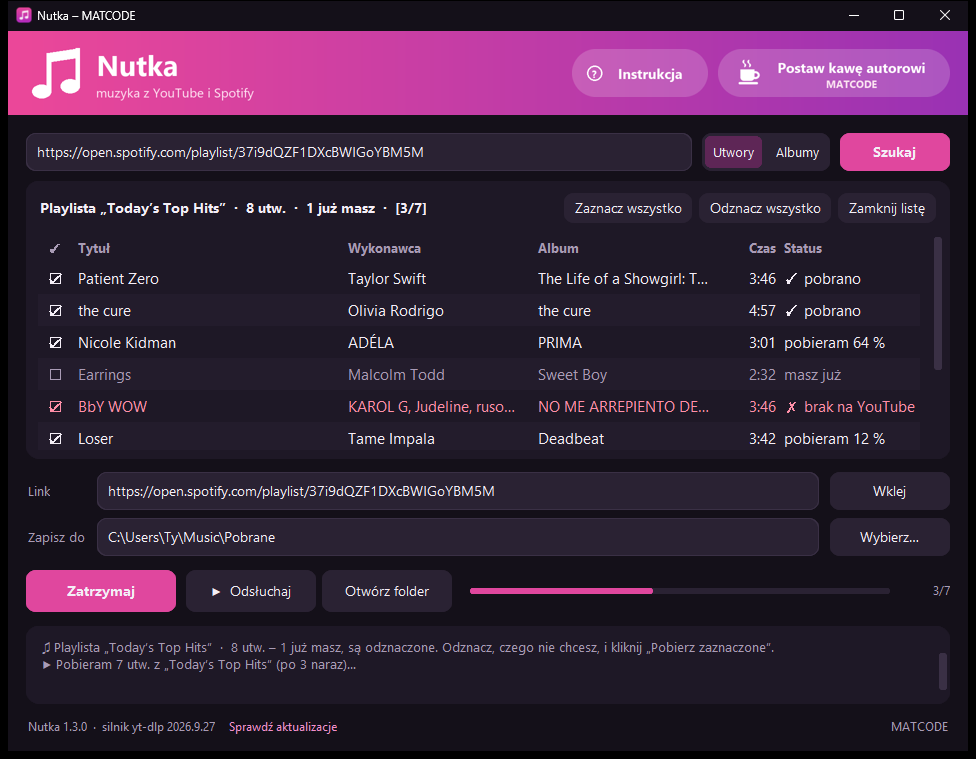

# Nutka

**Darmowy program do pobierania muzyki w mp3 – z YouTube, YouTube Music i playlist Spotify.**

### [⬇ Pobierz Nutkę dla Windows](https://github.com/matmiccode/nutka/releases/latest/download/Nutka-Setup.exe)

Jeden plik instalacyjny (~115 MB) · bez konta, bez reklam · instaluje się bez uprawnień administratora

## Co potrafi

- **Wyszukiwarka YouTube Music** – wpisz wykonawcę albo tytuł, wybierz utwór albo cały album.
- **Odsłuch przed pobraniem** – pojedynczy utwór albo cały album po kolei.
- **Playlisty i albumy ze Spotify** – wklej link, zobacz listę utworów, odznacz, czego nie chcesz, pobierz resztę.
  Przy kolejnym wczytaniu tej samej playlisty Nutka pobiera tylko nowe utwory.
- **Dobra jakość i porządek** – mp3 VBR ~250–270 kbps z okładką i tagami (tytuł, wykonawca, album, numer, rok).
  Albumy i playlisty trafiają do osobnych folderów.
- **Sam się aktualizuje** – silnik pobierania odświeża się po cichu, a o nowej wersji programu Nutka
  powie Ci sama i zainstaluje ją jednym kliknięciem.
- **Instrukcja pod ręką** – przycisk **Instrukcja** w prawym górnym rogu otwiera poradnik, także bez internetu.

## Instalacja

1. Pobierz **[Nutka-Setup.exe](https://github.com/matmiccode/nutka/releases/latest/download/Nutka-Setup.exe)**.
2. Uruchom go i przejdź przez instalator (około minuty).
3. Gotowe – Nutka jest w menu Start (i na pulpicie, jeśli zaznaczysz skrót).

> **„System Windows ochronił ten komputer”?** To ostrzeżenie pojawia się przy każdym nowym programie bez
> płatnego podpisu cyfrowego i z małą liczbą pobrań – nie znaczy, że plik jest groźny. Kliknij
> **Więcej informacji** → **Uruchom mimo to**. Instalator nie wymaga uprawnień administratora i nie zmienia
> ustawień systemu; kod programu jest w całości jawny w tym repozytorium.

Wymagania: Windows 10 lub 11 (64-bit), ~400 MB miejsca, internet do wyszukiwania i pobierania.

## Jak używać

| Chcę… | Co zrobić |
| --- | --- |
| pobrać piosenkę | wpisz tytuł w wyszukiwarkę → **dwuklik** na wyniku |
| pobrać album | przełącz na **Albumy**, wyszukaj → dwuklik |
| najpierw posłuchać | zaznacz wynik → **▶ Odsłuchaj** (**Następny** / **■ Stop**) |
| pobrać playlistę ze Spotify | w Spotify: **… → Udostępnij → Kopiuj link**, wklej w wyszukiwarkę → Enter → **Pobierz zaznaczone** |
| dociągnąć nowe utwory z playlisty | wczytaj ją jeszcze raz – to, co już masz, jest odznaczone |
| pobrać z linku YouTube | wklej link w pole **Link** → **Pobierz mp3** |

Pliki trafiają do `Muzyka\Pobrane` (zmienisz to przyciskiem **Wybierz…**).
Pełną instrukcję otworzysz w programie przyciskiem **Instrukcja** (działa bez internetu). Jest też online:
[matmiccode.github.io/nutka/instrukcja.html](https://matmiccode.github.io/nutka/instrukcja.html).

## Częste pytania

**Skąd jest muzyka?** Zawsze z YouTube (YouTube Music). Ze Spotify Nutka bierze tylko listę utworów
i ich opis – dźwięk pobiera z YouTube, dopasowując wykonawcę, tytuł i długość utworu.

**Czy to legalne?** Nutka jest narzędziem do użytku prywatnego. Pobieraj tylko na własny użytek
i nie rozpowszechniaj pobranych plików – szanuj prawa autorów i regulaminy serwisów.

**Prywatna playlista albo „Polubione utwory” się nie wczytują.** Nutka widzi tylko publiczne playlisty.
Ustaw playlistę jako publiczną (albo skopiuj utwory do publicznej) i spróbuj ponownie.

**Utwór się nie pobrał.** Czasem nie ma go na YouTube albo film jest zablokowany (np. ograniczenie wiekowe).
Nieudane utwory zostają zaznaczone – kliknij **Pobierz zaznaczone**, żeby spróbować jeszcze raz.

**Antywirus blokuje instalator.** W Zabezpieczeniach Windows: Ochrona przed wirusami i zagrożeniami →
Historia ochrony → wybierz zablokowany plik → Akcje → Zezwalaj na urządzeniu. Kod programu jest w całości
jawny w tym repozytorium.

**Coś nie działa.** W folderze programu (`%LOCALAPPDATA%\Programs\Nutka`) uruchom
`Nutka.exe --autotest > raport.txt` i dołącz `raport.txt` do [zgłoszenia](https://github.com/matmiccode/nutka/issues).

## Dla programistów

Nutka to Python 3.12 + CustomTkinter, spakowany PyInstallerem i Inno Setup.

| Plik | Co robi |
| --- | --- |
| `app.py` | okno, wyszukiwarka, odsłuch, pobieranie (yt-dlp w procesach potomnych) |
| `spotify_lista.py` | odczyt playlist/albumów Spotify (spotapi) i dopasowanie w YouTube Music |
| `aktualizacje.py` | ciche aktualizacje lekkich pakietów (yt-dlp, ytmusicapi, spotapi) z PyPI |
| `aktualizacja_programu.py` | propozycja i instalacja nowej wersji z GitHub Releases (tylko wydania podpisane kluczem autora) |
| `podpis_wydania.py` | podpis Ed25519 wydania – klucz prywatny leży poza repozytorium, publiczny jest w programie |
| `zbuduj.ps1` | build instalatora; `-Wydanie` publikuje wersję na GitHubie |
| `docs/` | strona programu i instrukcja na wspólnej ramie MATCODE (GitHub Pages; instrukcja trafia też do instalatora), zrzuty w `img/` |

Budowanie: Python 3.12, [Inno Setup 6](https://jrsoftware.org/isinfo.php), potem
`powershell -ExecutionPolicy Bypass -File zbuduj.ps1` → `dist\Nutka-Setup.exe`.
Nowa wersja: podbij `WERSJA` w `app.py`, dopisz sekcję w [CHANGELOG.md](CHANGELOG.md), `zbuduj.ps1 -Wydanie`
(podpisuje instalator kluczem z `podpis_wydania.py` i publikuje wydanie). Zasady bezpieczeństwa: [SECURITY.md](SECURITY.md).

## Wsparcie

Nutka jest darmowa i taka zostanie. Jeśli oszczędziła Ci czasu, możesz [postawić autorowi kawę](https://buycoffee.to/matcode) –
ale nie musisz. Dziękuję!

## Licencja

Kod Nutki: [MIT](LICENSE) © MATCODE.
Instalator zawiera programy i biblioteki innych autorów na ich licencjach (m.in. GPL) – lista w
[THIRD-PARTY.md](THIRD-PARTY.md). Nutka nie jest powiązana z YouTube, Google ani Spotify.

<b>MATCODE</b> – darmowe aplikacje

